# Portfolio

A performant, interactive personal portfolio built with Next.js 16, React 19, and WebGL. Designed as a platform for showcasing projects, professional experience, and technical capabilities with an emphasis on visual polish and maintainability.

---

## Technical Overview

This site serves as both a professional platform and an experimentation surface for modern web technologies. Core priorities:

- **Performance**: Static generation, optimized images, minimal JavaScript hydration
- **Maintainability**: Typed data layer, component-driven architecture, centralized configuration
- **Developer Experience**: Hot reload, strict TypeScript, ESLint integration

---

## Tech Stack

| Layer | Technology | Rationale |
|-------|------------|-----------|
| **Framework** | Next.js 16 (App Router) | Server components, file-based routing, built-in optimization |
| **Language** | TypeScript 5 | Type safety, IDE support, refactoring confidence |
| **Styling** | Tailwind CSS 4 | Utility-first, zero runtime, design system constraints |
| **3D Graphics** | Three.js + @react-three/fiber | Declarative WebGL, React integration, performant canvas rendering |
| **Animations** | Framer Motion | Gesture support, layout animations, spring physics |
| **Icons** | Lucide React | Tree-shakeable, consistent design language |
| **Linting** | ESLint 9 | Code quality, Next.js specific rules |

---

## Architecture

```mermaid
graph TD
    subgraph Client
        A[Browser] --> B[Next.js App Router]
    end

    subgraph Rendering
        B --> C[React 19 Server Components]
        C --> D[Client Components]
    end

    subgraph Presentation
        D --> E[Tailwind CSS]
        D --> F[Framer Motion]
        D --> G[Three.js Canvas]
    end

    subgraph Data
        H[data/site.ts] --> C
    end

    subgraph Deployment
        B --> I[Vercel / Static Export]
        I --> J[CDN Edge]
    end

    style A fill:#1a1a2e
    style B fill:#16213e
    style G fill:#0f3460
```



---

## Key Engineering Decisions

### 1. App Router over Pages Router
Next.js 16's App Router enables React Server Components, reducing client-side JavaScript. Layout nesting and parallel routes simplify the component hierarchy.

### 2. WebGL for Hero Background
The interactive warp mesh uses `@react-three/fiber` to render a high-density plane geometry that responds to cursor position. The canvas is isolated to the hero section to avoid unnecessary GPU overhead on scroll.

**Tradeoff**: Adds ~150KB to the bundle, but creates a memorable first impression without blocking interactivity.

### 3. Typed Data Layer
All content (projects, experience, socials) is defined in `data/site.ts` with TypeScript interfaces. This enables:
- Compile-time validation of content structure
- Easy content updates without touching components
- Potential migration to a headless CMS

### 4. Tailwind over CSS-in-JS
Tailwind's utility classes eliminate runtime style injection. Custom utilities (`.glass`, `.glass-hover`) handle repeated patterns while maintaining design consistency.

### 5. Motion-Based Section Reveals
Framer Motion's `whileInView` triggers animate sections on scroll with a single render pass. `viewport={{ once: true }}` prevents re-animation on scroll-back.

---

## Performance & Optimization

| Technique | Implementation |
|-----------|----------------|
| **Image Optimization** | Next.js `<Image>` with automatic WebP/AVIF conversion, lazy loading |
| **Code Splitting** | Automatic per-route chunking via App Router |
| **Font Optimization** | `next/font` for Geist with `font-display: swap` |
| **Canvas Isolation** | WebGL context mounted only in hero; disposed on unmount |
| **Reduced Motion** | Three.js animation respects `prefers-reduced-motion` |
| **Static Generation** | Pre-rendered at build time; no runtime data fetching |

---

## Local Development

```bash
# Install dependencies
npm install

# Start development server (http://localhost:3000)
npm run dev

# Type-check and lint
npm run lint

# Production build
npm run build

# Preview production build
npm run start
```

### Requirements
- Node.js 18.17+
- npm 9+

---

## Project Structure

```
├── app/
│   ├── page.tsx          # Main page with all sections
│   ├── layout.tsx        # Root layout, fonts, metadata
│   └── globals.css       # Tailwind imports, custom utilities
├── components/
│   ├── HeroMesh.tsx      # Three.js interactive warp background
│   ├── Nav.tsx           # Sticky navigation with mobile menu
│   ├── Section.tsx       # Animated section wrapper
│   └── Container.tsx     # Max-width content wrapper
├── data/
│   └── site.ts           # Typed content: projects, experience, socials
└── public/
    ├── hobbies/          # Hobby section images
    └── resume.pdf        # Downloadable resume
```

---

## Extensibility

### Adding a New Project
1. Edit `data/site.ts`
2. Add entry to `projects` array with title, description, tags, and URLs
3. Rebuild

### Adding a New Section
1. Create section JSX in `app/page.tsx`
2. Wrap with `<Section id="section-name">`
3. Add navigation link in `components/Nav.tsx`

### Swapping the Hero Background
The `<HeroMesh />` component is self-contained. Replace with any React component; ensure it uses `absolute inset-0 -z-10` positioning.

---

## License

MIT

---

Built with Next.js, Three.js, and Tailwind CSS.
